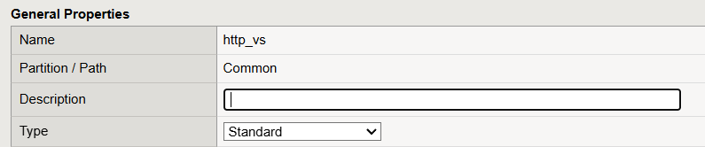
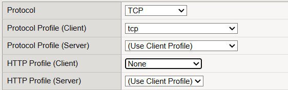
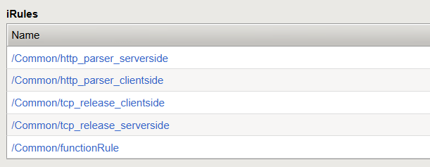
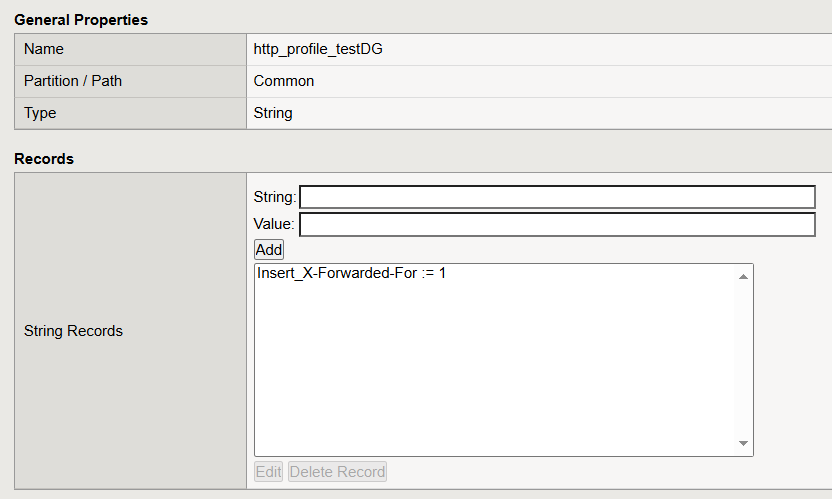

# How to make these iRules take effect

## Configuration on Virtual Server

* Prepare a **Virtual Server** that proxies HTTP traffic (Type : Standard)

* Mount the **TCP profile** on the **Virtual Server**, do not mount the **HTTP profile**

* Mount the iRules on the **Virtual Server**

## Configuration on Data Group

* Create and edit the data group "**http_profile_testDG**" (Don't change the DG's name)

    * The following diagram shows the DG configuration with the **Insert XFF** feature enabled.

